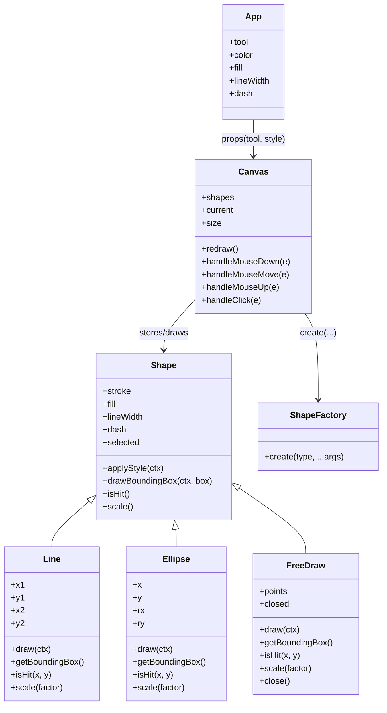

# React Canvas Paint – dokumentacija projekta

Ovaj dokument je izrađen kao službena dokumentacija projekta i pokriva:

1. opis sustava/igrice
2. upute za pokretanje i korištenje
3. popis i objašnjenje svih komponenti
4. UML dijagram klasa cijelog sustava

---

## 1) Opis sustava / igrice

**React Canvas Paint** je jednostavna web aplikacija za crtanje (paint-like alat) izrađena u **Reactu** i pokrenuta kroz **Vite**. Korisnik crta po HTML `<canvas>` površini i može birati više načina crtanja:

- **Pencil (freedraw)** – slobodno crtanje linijama kroz niz točaka miša.
- **Line** – crtanje ravne linije od točke pritiska do točke otpuštanja miša.
- **Circle (ellipse)** – dodavanje elipse (kružnice/ovalnog oblika) klikom.

Uz odabir alata, podržane su i stilizacije crtanja:

- boja poteza
- debljina poteza
- puna ili isprekidana linija
- ispunjavanje oblika (Fill / No Fill)

Sustav koristi objektni model oblika (`Shape`, `Line`, `Ellipse`, `FreeDraw`) i **Factory** obrazac (`ShapeFactory`) za instanciranje pojedinih tipova oblika.

---

## 2) Kako pokrenuti i koristiti aplikaciju

## Preduvjeti

- instaliran **Node.js** (preporučeno LTS izdanje)
- instaliran **npm** (dolazi uz Node.js)

## Pokretanje (development način)

1. Otvoriti terminal u korijenu projekta.
2. Instalirati ovisnosti:

```bash
npm install
```

3. Pokrenuti razvojni server:

```bash
npm run dev
```

4. Otvoriti URL koji Vite ispiše u terminalu (najčešće `http://localhost:5173`).

## Build za produkciju

```bash
npm run build
```

Generirani build nalazi se u `dist/` mapi.

## Korištenje aplikacije

1. U gornjem izborniku odaberi alat:
   - **Pencil** za slobodno crtanje
   - **Line** za ravne linije
   - **Circle** za elipse
2. Po potrebi odaberi:
   - **Solid** ili **Dashed** stil linije
   - **Fill** ili **No Fill**
3. Odaberi boju putem **Color** inputa.
4. Podesi debljinu linije pomoću **Size** klizača.
5. Crtaj po bijelom canvas području.
6. Klik na postojeći oblik označava ga (plavi isprekidani bounding box kod oblika koji ga crtaju).

---

## 3) Popis i objašnjenje svih komponenti

U nastavku je pregled svih bitnih datoteka i komponenti sustava.

## Aplikacijski sloj (React)

- **`src/main.jsx`**  
  Ulazna točka aplikacije. Kreira React root i renderira `<App />` unutar `React.StrictMode`.

- **`src/App.jsx`**  
  Glavna UI komponenta:
  - drži globalno stanje alata i stila crtanja (`tool`, `color`, `fill`, `lineWidth`, `dash`)
  - prikazuje toolbar (gumbi i input kontrole)
  - prosljeđuje odabrani alat i stil komponenti `<Canvas />`

- **`src/Canvas.jsx`**  
  Komponenta koja upravlja `<canvas>` elementom i interakcijom miša:
  - prati listu nacrtanih oblika (`shapes`)
  - obrađuje događaje `onMouseDown`, `onMouseMove`, `onMouseUp`, `onClick`
  - koristi `ShapeFactory` za stvaranje konkretnih oblika
  - dinamički prilagođava veličinu canvasa pri promjeni veličine prozora
  - ponovno iscrtava sve oblike (`redraw`) nakon promjena

- **`src/App.css`**  
  Stilovi aplikacije:
  - tamna tema sučelja
  - stilizacija toolbar gumba i aktivnih stanja
  - stilizacija canvas okvira

## Model i logika oblika (OOP)

- **`src/shapes/Shape.js`** (bazna klasa)  
  Apstraktna/osnovna klasa za sve oblike:
  - zajednički stil (`stroke`, `fill`, `lineWidth`, `dash`)
  - metoda `applyStyle(ctx)`
  - pomoćna metoda `drawBoundingBox(ctx, box)`
  - default implementacije `isHit()` i `scale()`

- **`src/shapes/Line.js`**  
  Nasljeđuje `Shape` i predstavlja liniju definiranu koordinatama početka i kraja. Implementira:
  - `draw(ctx)`
  - `getBoundingBox()`
  - `isHit(x, y)`
  - `scale(factor)`

- **`src/shapes/Ellipse.js`**  
  Nasljeđuje `Shape` i predstavlja elipsu definiranu centrom i radijusima (`rx`, `ry`). Implementira:
  - `draw(ctx)`
  - `getBoundingBox()`
  - `isHit(x, y)` (provjera pripadnosti točke elipsi)
  - `scale(factor)`

- **`src/shapes/FreeDraw.js`**  
  Nasljeđuje `Shape` i predstavlja slobodno crtanje kroz listu točaka. Implementira:
  - `draw(ctx)`
  - `getBoundingBox()`
  - `isHit(x, y)`
  - `scale(factor)`
  - `close()` za zatvaranje putanje

- **`src/shapes/ShapeFactory.js`**  
  Factory objekt s metodom `create(type, ...args)` koja ovisno o tipu (`line`, `ellipse`, `freedraw`) vraća odgovarajuću instancu klase.

## Ostalo

- **`src/utils.js`**  
  Trenutno nije korišten u aktivnoj logici (prazna pomoćna datoteka).

---

## 4) UML dijagram klasa cijelog sustava

Ispod je UML dijagram klasa u Mermaid formatu (može se renderirati u editorima/platformama koje podržavaju Mermaid).



> Ako je potreban "klasični" UML kao slika za predaju (npr. Word/PDF), preporuka je otvoriti ovaj model u **draw.io** ili **Lucidchart** i izvesti ga kao PNG/SVG.

---

## Kratki tehnički sažetak

- Tehnologije: **React, Vite, HTML5 Canvas, CSS**
- Arhitektura crtanja: **OOP + Factory pattern**
- Status: osnovna funkcionalna paint aplikacija s više alata i stilova crtanja
